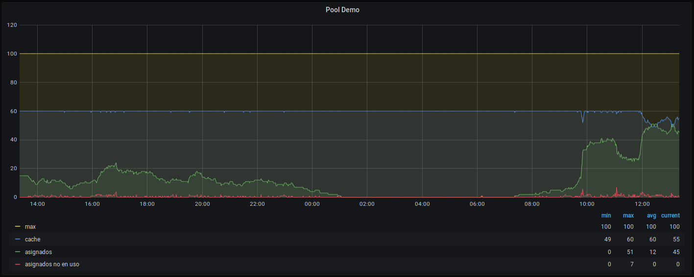

# OpenUDS monitor

OpenUDS dispatcher to generate prometheus metrics.

[OpenUDS](https://github.com/dkmstr/openuds) is an awesome connection broker for VDI. As a pool usage monitoring system provides a two-graph dashboard but it's quite limited: it only saves data every 10 minutes and the usage metric is for all pools as a whole.

In order to avoid these limitation we can use the, also awesome, Prometheus/Grafana stack to provide a real time OpenUDS pool usage monitoring system that graphs pool usage every minute and for each pool separately.

The resulting graphs is something like this:


*DISCLAIMER*: This stuff is only to get a real time monitoring system of the pools' usage. It is not intended to get more advanced stats or accounting.

## How it works
The main idea is to use one of OpenUDS's cool features ("dispatchers") to create a python script that exposes wanted metrics to prometheus and create Grafana Dashboard(s) to graph these data.

There is also included a docker-compose file to launch a Grafana/Prometheus server as a proof of concept.

## Setup and configuration

### TL;DR
In a freshly installed linux (e.g. ubuntu):
```console
<clone repo: see the trailing dot>
$ git clone https://github.com/danitorregrosa/openuds_monitor .

<copy dispatcher to OpenUDS broker>
$ scp -r openuds_broker/var/server/uds/dispatchers/prometheus root@$IP_BROKER:/var/server/uds/dispatchers/
<ssh into OpenUDS Broker: set owner/group and restart services>
$ ssh root@$IP_BROKER
$ chown -R uds:www-data /var/server/uds/dispatchers/prometheus
$ systemctl restart udsweb.service uds.service
$ exit

< edit prometheus target URL (replace vdi.domain.com) >
$ vim openuds_monitor/prometheus/prometheus.yml

<docker and grafana/prometheus>
$ cd openuds_monitor
$ sudo apt install docker-compose
$ sudo systemctl start docker
$ sudo docker-compose up -d
<wait two minutes and open in a browser https://$IP_MONITOR>
```

### OpenUDS prometheus dispatcher
Copy [`prometheus` ](./openuds_broker/var/server/uds/dispatchers/prometheus/) folder to OpenUDS broker server with correct owner/group and permissions.
Reboot/restart the broker and there will be two new http endpoints (e.g: https://broker.domain.com/prom ), also /uds/prom, that should return the pool usage data.

*NOTE*: The dispatcher is for v3+ of OpenUDs, but is easyly modificable for v2.

*SECURITY NOTE*: If you want to limit access to this endpoint, edit `ALLOWED_IPS` variable in `./openuds_broker/var/server/uds/dispatchers/prometheus/views.py` file, but remember to add monitor host ip address.

### Grafana/Prometheus
If you already have Prometheus/Grafana servers you probably will only need the prometheus dispatcher and the sample [Grafana dashboards](./openuds_monitor/grafana/provisioning/dashboards/).

Otherwise, here is also a docker-compose file to launch Prometheus/Grafana stack.

Get a new linux server (e.g.ubuntu) and install `docker-compose`. Copy the [openuds_monitor](./openuds_monitor) folder to the server.

#### Configuration
Replace `target` variable in [prometheus configuration file](./openuds_monitor/prometheus/prometheus.yml) (replace `vdi.domain.com` by your service url).

*OPTIONAL*: Default Grafana admin password is inside [docker-compose file](./openuds_monitor/docker-compose.yml) file. Replace `GF_SECURITY_ADMIN_PASSWORD` variable if you want to change it.

*OPTIONAL*: Copy your SSL cert/key for monitor server to ./openuds_monitor/nginx/ssl/ or generate your own self-signed certs (considering its security implications) with:
```
$ openssl req -x509 -nodes -days 3650 -newkey rsa:2048 -keyout openuds_monitor/nginx/ssl/key.pem -out openuds_monitor/nginx/ssl/cert.pem
```

#### Usage
Start the docker-compose stuff with `docker-compose up -d`. It should download grafana/prometheus/nginx docker images and:
 - launch prometheus and start scrapping data.
 - launch grafana server.
 - launch nginx web server as a internal proxy.

Wait one or two minutes to let prometheus scrape some data. At the end you can point your browser to  `monitor fqdn` (https) and there should be a simple html with links to Grafana and to the rest of the internal services.

Login in Grafana and go to `Dashboards > Manage`. There are two sample dashboards:
- openuds monitor: graphs pool usage and some authenticator counters.
- openuds monitor with peaks values: it's the same as previous one, but it takes max (or min) values across a period of time if there are more data than physical points to paint in the graph.

Select one dashboard and enjoy the awesome Grafana interface experience.

*DISK_SPACE NOTE*: All scrapped data will be saved in `/var/lib/docker/volumes/`, so reserve some GB in this path's partition.

*SECURITY NOTE*: There will be a new port (TCP 443) opened in your monitor server. Modify your hosts/network firewalls if you want to protect it.

## [ToDo] Node_exporters
From here, it's easy to add node_exporter to each node (broker, tunneler and monitor) in order to graph their ram/cpu/disk usage.

## [ToDo] Tunneler connections monitoring
Using node_exporter we can also monitor tunneler usage (both ssh tunnel and html5), using collector textfiles.

Quick hints:
```
root@tun01:~# cat /home/node_exporter/prom/roles.prom 
machine_role{role="udstunnel"} 1
root@tun01:~# cat /home/node_exporter/process_count.awk
BEGIN {
    guacamole = 0;
    ssh443 = 0;
}
/.*STAB.*:10443 / {
    guacamole++;
}
/.*STAB.*:443 / {
    ssh443++;
}
END {
    printf("process_count{name=\"guacamole\"} %d\n", guacamole);
    printf("process_count{name=\"ssh443\"} %d\n", ssh443);
}
root@tun01:~# crontab -l -u node_exporter | grep pro
* * * * * /bin/sh -c 'ss -tan | awk -f /home/node_exporter/process_count.awk' > /home/node_exporter/prom/process_count.prom.$$ && mv /home/node_exporter/prom/process_count.prom.$$ /home/node_exporter/prom/process_count.prom
root@tun01:~# grep prom /etc/systemd/system/node_exporter.service
ExecStart=/usr/local/bin/node_exporter --web.listen-address=":8443" --web.config="/home/node_exporter/web-config.yml" --collector.textfile.directory="/home/node_exporter/prom"
```


## References and credits
- [OpenUDS](https://github.com/dkmstr/openuds). Dispatcher skeleton based on its source.
- [docker-compose](https://github.com/docker/compose) stuff mainly based on [vegasbrianc's](https://github.com/vegasbrianc) repos
- [Grafana](https://grafana.com/)
- [Prometheus](https://prometheus.io/)
- [NGINX](https://www.nginx.com/) config [freecodecamp.org](https://www.freecodecamp.org/news/docker-nginx-letsencrypt-easy-secure-reverse-proxy-40165ba3aee2/)


